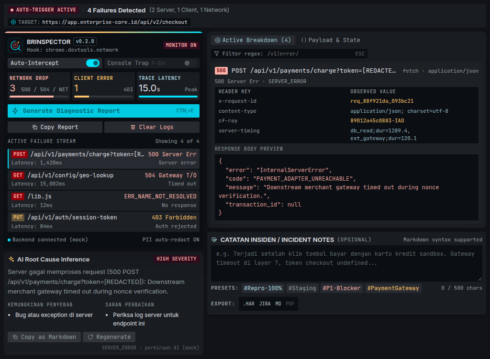

# BRINSPECTOR

Chrome extension yang menangkap request gagal dari tab **Network** DevTools dan menjelaskan akar masalah serta langkah perbaikannya dengan AI. Data sensitif diredaksi sebelum apa pun dikirim.



> Tugas akhir workshop GitHub Copilot. Mulai dari **[docs/panduan-langkah.md](docs/panduan-langkah.md)**.
> Desain: [Figma — BRINSPECTOR](https://www.figma.com/design/n4DsSHcxUMYVAl2JW5mbPH/Untitled?node-id=0-1) (frame 1:1130 = panel DevTools).

## Struktur

```
brinspector/
├── AGENTS.md                     # Aturan untuk Copilot (review & tulis ulang oleh tim)
├── .github/
│   ├── copilot-instructions.md   # Lokasi spec
│   ├── prompts/                  # /implement-checkpoint, /new-feature-spec
│   └── agents/                   # spec-reviewer, readme-creator
├── .githooks/pre-push            # Tolak push jika unit test gagal
├── .vscode/mcp.json              # chrome-devtools MCP
├── docs/
│   ├── plan.md                   # Spec MVP + arsitektur + kontrak API (source of truth)
│   ├── progress.md               # Status terkini
│   └── panduan-langkah.md        # Langkah kerja tim
├── specs/features/               # F-001 … F-006 + template
├── extension/                    # MV3 + Vue 3 + Vite
│   ├── public/                   # manifest.json, ikon
│   └── src/
│       ├── lib/                  # Logika murni: filter, redaksi, payload, format, stats, report
│       └── panel/                # UI panel DevTools
│           ├── components/       # StatusBanner, InspectorHud, AiRootCauseCard, BreakdownPanel, StackTraceViewer, IncidentNotes, …
│           └── panel.css         # Design tokens dari Figma
├── backend/                      # Fastify: /health, /api/summarize (mock | azure | openai)
└── tests/e2e/                    # Playwright (panel dengan chrome.devtools tiruan)
```

## Mulai cepat

```bash
npm install
cp backend/.env.example backend/.env
cp extension/.env.example extension/.env
npm run dev:backend      # http://localhost:3000/health
npm run build:ext        # lalu chrome://extensions → Load unpacked → extension/dist
```

Buka DevTools di website mana pun → tab **BRINSPECTOR**.

## Perintah

| Perintah | Fungsi |
| --- | --- |
| `npm run dev:backend` | Backend dengan auto-reload |
| `npm run dev:ext` | Build extension terus-menerus (watch) |
| `npm test` | Unit test (extension + backend) |
| `npm run test:coverage` | Unit test + coverage |
| `npm run test:e2e` | E2E Playwright |

## Status

v0.2.0: panel sesuai desain Figma, AI Root Cause (mode mock), redaksi dasar, incident notes & export (.HAR/JIRA/MD), UI stack trace, 110 test. Backlog: [docs/progress.md](docs/progress.md).
