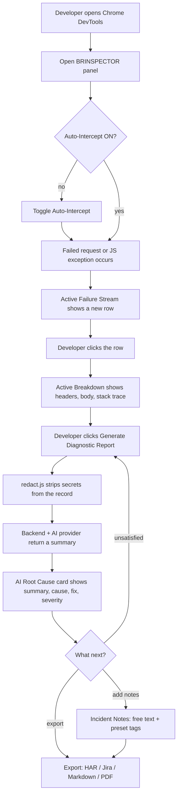

# Architecture — BRINSPECTOR

> Companion to `docs/plan.md` (source of truth) and `docs/progress.md` (current state).
> Figma file: `n4DsSHcxUMYVAl2JW5mbPH` — node links below match `docs/plan.md` §11.

## 1. Overview

BRINSPECTOR is a Chrome extension with two surfaces:

- **DevTools panel** (`extension/src/panel/`) — the main engine. It reads failed requests from
  `chrome.devtools.network`, optionally hooks page exceptions via `chrome.devtools.inspectedWindow`,
  redacts sensitive data, and asks the BRINSPECTOR **backend** (Fastify) for an AI root-cause summary.
- **Popup + badge** (F-005, backlog) — a lightweight counter built on `chrome.webRequest`
  (status/headers only, no body) that links back to the panel for detail.

The AI provider (mock / Microsoft Foundry / OpenAI-compatible) is only ever called from the backend.
The extension never stores an API key and never talks to the AI provider directly.

## 2. Components → Figma nodes

Panel components (`extension/src/panel/components/`) map 1:1 to Figma frames from `docs/plan.md` §11:

| Component | Figma node | Frame name | Link |
| --- | --- | --- | --- |
| Panel shell (`App.vue`, F-001/F-002) | 1:1130 | BRINSPECTOR - Extension Popup & Error Inspector | [open](https://www.figma.com/design/n4DsSHcxUMYVAl2JW5mbPH/Untitled?node-id=1-1130) |
| [StatusBanner.vue](../extension/src/panel/components/StatusBanner.vue) | 1:1133 | Top System Live Diagnostic Status Banner | [open](https://www.figma.com/design/n4DsSHcxUMYVAl2JW5mbPH/Untitled?node-id=1-1133) |
| [InspectorHud.vue](../extension/src/panel/components/InspectorHud.vue) | 1:1159 | Extension Popup Shell Container | [open](https://www.figma.com/design/n4DsSHcxUMYVAl2JW5mbPH/Untitled?node-id=1-1159) |
| [AiRootCauseCard.vue](../extension/src/panel/components/AiRootCauseCard.vue) | 1:1298 | Quick Summary AI Drawer / Diagnostic Widget | [open](https://www.figma.com/design/n4DsSHcxUMYVAl2JW5mbPH/Untitled?node-id=1-1298) |
| [BreakdownPanel.vue](../extension/src/panel/components/BreakdownPanel.vue) | 1:1345 | Deep Diagnostic Breakdown 1: 500 Payment Error Inspect | [open](https://www.figma.com/design/n4DsSHcxUMYVAl2JW5mbPH/Untitled?node-id=1-1345) |
| [StackTraceViewer.vue](../extension/src/panel/components/StackTraceViewer.vue) (F-004) | 1:1392 | Deep Diagnostic Breakdown 2: Console Stack Trace Viewer | [open](https://www.figma.com/design/n4DsSHcxUMYVAl2JW5mbPH/Untitled?node-id=1-1392) |
| [IncidentNotes.vue](../extension/src/panel/components/IncidentNotes.vue) (F-006) | 1:776 | BRINSPECTOR - Triggered Extension Modal & Diagnostics | [open](https://www.figma.com/design/n4DsSHcxUMYVAl2JW5mbPH/Untitled?node-id=1-776) |
| [ExportFormatSelector.vue](../extension/src/panel/components/ExportFormatSelector.vue) (F-006) | 1:776 | BRINSPECTOR - Triggered Extension Modal & Diagnostics | [open](https://www.figma.com/design/n4DsSHcxUMYVAl2JW5mbPH/Untitled?node-id=1-776) |
| Popup + badge (F-005, backlog) | 1:451 | BRINSPECTOR - Default Chrome UI with Cyber Extension | [open](https://www.figma.com/design/n4DsSHcxUMYVAl2JW5mbPH/Untitled?node-id=1-451) |
| Popup variant (F-005, backlog) | 1:2 | BRINSPECTOR - Chrome Extension Installed View | [open](https://www.figma.com/design/n4DsSHcxUMYVAl2JW5mbPH/Untitled?node-id=1-2) |
| Extension icon (`public/icons/`) | 1:1121 | BRINSPECTOR Extension Logo | [open](https://www.figma.com/design/n4DsSHcxUMYVAl2JW5mbPH/Untitled?node-id=1-1121) |

`FailureStreamItem.vue`, `StatCard.vue`, `BiIcon.vue` and `ToggleSwitch.vue` are shared building blocks
inside the 1:1130/1:1159 frames and have no dedicated top-level node.

## 3. Modules

| Layer | Path | Responsibility |
| --- | --- | --- |
| Chrome plumbing | `extension/src/devtools.js`, `extension/src/panel/*` | Only files allowed to call `chrome.devtools.*` (AGENTS.md) |
| Pure logic | `extension/src/lib/` | `errorFilter`, `redact`, `buildPayload`, `apiClient`, `format`, `stats`, `filter`, `report`, `stack`, `consoleTrap` — no `chrome.*` calls, unit-testable |
| Backend routes | `backend/src/routes/summarize.js` | Thin Fastify route: schema validation, calls the summarizer, maps errors to 422/502 |
| Backend services | `backend/src/services/` | `redact.js` (server-side redaction), `prompt.js` (prompt building), `summarizer.js` (provider dispatch: mock/azure/openai) |

## 4. User flow



## 5. Sequence: panel → redact → backend → AI provider

```mermaid
sequenceDiagram
  participant U as Developer
  participant P as Panel (App.vue)
  participant R as redact.js (extension)
  participant BP as buildPayload.js
  participant AC as apiClient.js
  participant BE as Backend (Fastify /api/summarize)
  participant BR as redact.js (backend)
  participant AI as AI Provider (mock/azure/openai)

  U->>P: Click "Generate Diagnostic Report"
  P->>R: redactRecord(selectedError)
  R-->>P: safe record (headers/body/URL masked)
  P->>BP: buildSummarizePayload(safe record, language)
  BP-->>P: { language, error }
  P->>AC: summarizeError(payload)
  AC->>BE: POST /api/summarize (JSON)
  BE->>BE: schema validation (422 if invalid)
  BE->>BR: redactRecord(error) (defense in depth)
  BR-->>BE: re-redacted error
  alt provider === mock
    BE->>BE: mockSummary(error, language)
  else provider === azure/openai
    BE->>AI: chat completion request (buildMessages)
    AI-->>BE: completion (summary/category/causes/fixes/severity)
  end
  BE-->>AC: 200 { summary, category, likelyCauses, suggestedFixes, severity, provider }
  AC-->>P: parsed JSON (or thrown Error on !ok / timeout)
  P-->>U: AiRootCauseCard renders result (or ai-error state)
  Note over BE,AI: 502 returned if the provider call fails or times out;<br/>backend never logs request/response bodies or headers.
```

## 6. Privacy — redaction happens twice

1. **Extension** (`extension/src/lib/redact.js`): masks `authorization`/`cookie`/`x-api-key`/… headers,
   JWTs, bearer tokens, emails, Indonesian phone numbers, NIK/16-digit sequences, and truncates
   bodies to `MAX_BODY_CHARS` (4000) — *before* anything leaves the browser.
2. **Backend** (`backend/src/services/redact.js`): re-applies the same class of redaction to whatever
   arrives, so a compromised or modified extension build still can't leak secrets through the API.

No data is sent to the AI provider without the user clicking **Generate Diagnostic Report** — there is
no background/automatic upload.

## 7. Backend endpoints

| Method | Path | Notes |
| --- | --- | --- |
| GET | `/health` | Liveness + active provider name |
| POST | `/api/summarize` | Body: `{ language, error }`; returns `{ summary, category, likelyCauses, suggestedFixes, severity, provider }`; 422 invalid payload, 413 body too large, 502 provider failure |
| GET | `/api-docs` | Swagger UI (schema-generated from `routes/summarize.js`) |

## 8. Testing

- Unit: `extension/tests/unit/` (Jest, jsdom-free pure functions), `backend/tests/` (Jest).
- E2E: `tests/e2e/` (Playwright) drives the built panel against a stubbed `chrome.devtools` API
  (`tests/e2e/chromeStub.js`) covering capture, filtering, Console Trap, and incident report export.

See `docs/progress.md` for what is implemented today and `docs/runbook.md` for the task order.
