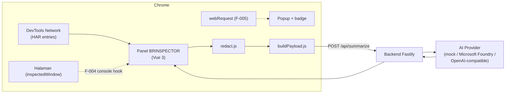

# BRINSPECTOR — Rencana MVP (Spec Utama)

> Dokumen ini adalah **source of truth** proyek (Spec-Driven Development).
> Setiap perubahan besar harus dimulai dari sini, lalu turun ke `specs/features/`.
> Desain UI: [Figma — BRINSPECTOR](https://www.figma.com/design/n4DsSHcxUMYVAl2JW5mbPH/Untitled?node-id=0-1) — link per node ada di §11.

## 1. Intent

Membantu developer & QA memahami error website lebih cepat: **BRINSPECTOR**, sebuah Chrome extension yang menangkap request gagal (dan nantinya JS exception), lalu meminta **AI** menjelaskan akar masalah dan langkah perbaikannya — tanpa membocorkan data sensitif.

## 2. Masalah yang diselesaikan

- Error di tab Network (4xx, 5xx, CORS, timeout, DNS) sering tersebar dan sulit dibaca, terutama respons berupa stack trace atau HTML error panjang.
- Developer junior/QA butuh waktu lama untuk menerjemahkan error menjadi tindakan dan laporan bug.
- Menyalin error ke chatbot secara manual berisiko membocorkan token, cookie, dan data nasabah.

## 3. Pengguna

| Persona | Kebutuhan |
| --- | --- |
| Frontend/Backend developer | Tahu akar masalah & endpoint/file yang perlu dicek |
| QA engineer | Laporan insiden rapi yang bisa disalin ke Jira |
| Tech lead | Gambaran cepat jumlah & jenis kegagalan |

## 4. Arsitektur: hybrid

| Permukaan | Figma | Peran | API Chrome | Izin |
| --- | --- | --- | --- | --- |
| **Panel DevTools "BRINSPECTOR"** (mesin utama) | frame 1:1130 *Error Inspector*, 1:776 *Incident Diagnostics* | Tangkap error lengkap (header + body), detail, AI root cause, laporan | `chrome.devtools.network`, `chrome.devtools.inspectedWindow` | tidak ada tambahan |
| **Popup toolbar + badge** (fitur F-005) | frame 1:2, 1:451 | Counter error di background & ringkasan cepat; arahkan ke panel untuk detail | `chrome.webRequest` (status & header saja, **tanpa body**), `chrome.action` | `webRequest`, `host_permissions` |

Alasan: `chrome.webRequest` tidak dapat membaca response body; `chrome.debugger` bisa, tetapi memunculkan banner "sedang di-debug" dan izinnya terlalu luas untuk lingkungan bank. Karena itu analisis mendalam hanya di panel DevTools.



Keputusan penting:
- **API key AI tidak pernah disimpan di extension.** Extension hanya bicara ke backend milik tim.
- **Redaksi dua lapis:** di extension (sebelum data meninggalkan browser) dan di backend.
- **Mode mock** menjadi default agar demo & test berjalan tanpa key dan tanpa biaya token.
- **Tidak ada angka "confidence %" dari AI** (tidak terkalibrasi); tampilkan *severity* dan label "perkiraan AI".

## 5. Scope

### Baseline (sudah ada di starter)
- Panel DevTools "BRINSPECTOR" bergaya desain Figma frame 1:1130: banner status, kartu statistik, *Active Failure Stream*, *Active Breakdown* (header + response body), filter regex, toggle Auto-Intercept.
- Kartu **AI Root Cause Inference** terhubung ke `POST /api/summarize` (mode mock).
- Redaksi dasar (header, query, field JSON, JWT/Bearer) + unit test.
- Backend Fastify: `GET /health`, `POST /api/summarize` (mock / azure / openai).

### Backlog tim — MVP
| ID | Fitur | Spec |
| --- | --- | --- |
| F-001 | Tangkap & tampilkan error network (sisa: tab *Payload & State*, separator navigasi, filter kategori) | `specs/features/F-001-capture-network-errors/spec.md` |
| F-002 | AI Root Cause (sisa: provider nyata Foundry, Copy as Markdown yang rapi, pilihan bahasa) | `specs/features/F-002-ai-summary/spec.md` |
| F-003 | Redaksi data sensitif (sisa: PII teks bebas, redaksi ulang di backend, preview payload) | `specs/features/F-003-privacy-redaction/spec.md` |
| F-004 | Console & JS exceptions (sisa: hook Console Trap, baris `JS ERR`, kartu *Exceptions*; UI stack trace sudah ada) | `specs/features/F-004-console-exceptions/spec.md` |
| F-006 | Incident notes & export (sisa: kartu Diagnostic Bundle Packed; notes, tag, .HAR/JIRA/MD/PDF sudah ada) | `specs/features/F-006-incident-report-export/spec.md` |
| F-005 | Popup toolbar + badge counter (sisa: verifikasi manual Chrome asli, E2E) | `specs/features/F-005-toolbar-popup-badge/spec.md` |

### Eksplorasi (via OpenSpec `/opsx:propose`)
- F-007 Screenshot viewport otomatis dengan penanda elemen gagal — **wajib opt-in dan blur area input**.
- F-008 Halaman Options: URL backend, bahasa ringkasan, batas ukuran body.

### Di luar scope (ide dari desain, ditunda)
Send to VS Code Debugger, Apply Hot-Mock, Shareable Replay URL, Memory Pressure, pemetaan source map, Waterfall.

## 6. Tech stack

- Extension: Chrome Manifest V3 + Vue 3 + Vite + JavaScript
- Backend: Fastify + JavaScript (Node.js 20+)
- AI: Microsoft Foundry (Azure OpenAI) atau endpoint OpenAI-compatible, lewat backend
- Testing: Jest (unit) + Playwright (E2E)
- Dokumentasi API: `@fastify/swagger` + `@fastify/swagger-ui` di `/api-docs`
- Desain: Figma (+ Figma MCP)
- Tools: GitHub Copilot (Plan/Agent mode), RTK, Graphify, OpenSpec

## 7. Kontrak API

### `POST /api/summarize`

Request:
```json
{
  "language": "id",
  "error": {
    "method": "POST",
    "url": "https://api.example.com/v1/transfer?token=[REDACTED]",
    "status": 500,
    "statusText": "Internal Server Error",
    "errorText": null,
    "resourceType": "fetch",
    "durationMs": 812,
    "requestHeaders": { "content-type": "application/json", "authorization": "[REDACTED]" },
    "responseHeaders": { "content-type": "application/json" },
    "requestBody": "{\"amount\":100000}",
    "responseBody": "{\"message\":\"NullPointerException at TransferService.java:42\"}"
  }
}
```

Response `200`:
```json
{
  "summary": "Server gagal memproses transfer karena NullPointerException di TransferService.",
  "category": "SERVER_ERROR",
  "likelyCauses": ["..."],
  "suggestedFixes": ["..."],
  "severity": "high",
  "provider": "mock"
}
```

Aturan:
- `422` bila payload tidak valid (mis. `error.url` kosong, `status` bukan angka) dengan pesan jelas.
- `413` bila body melebihi batas (default 64 KB).
- `502` bila AI provider gagal / timeout, tanpa membocorkan detail internal.
- `category` ∈ `CLIENT_ERROR`, `AUTH_ERROR`, `NOT_FOUND`, `SERVER_ERROR`, `NETWORK_ERROR`, `CORS_ERROR`, `TIMEOUT`, `UNKNOWN`.
- `severity` ∈ `low`, `medium`, `high`.

## 8. Constraints

- Tidak ada data yang dikirim ke AI tanpa klik pengguna (opt-in per error).
- Body request/response dipotong maksimal 4.000 karakter sebelum dikirim.
- Header `authorization`, `cookie`, `set-cookie`, `x-api-key`, `proxy-authorization` selalu diredaksi.
- Panel DevTools tidak menambah izin manifest. Popup (F-005) hanya boleh menambah `webRequest` + host yang diperlukan, dengan persetujuan tim.
- Screenshot (F-007) tidak pernah dikirim ke AI tanpa blur & persetujuan eksplisit.
- Waktu respons ringkasan target < 10 detik; timeout backend 20 detik.

## 9. Acceptance criteria MVP

- [ ] Panel "BRINSPECTOR" muncul di DevTools setelah extension di-load (unpacked), tampilan sesuai frame 1:1130.
- [ ] Request 4xx/5xx/network error muncul di *Active Failure Stream* < 1 detik setelah selesai; 2xx/3xx tidak.
- [ ] Klik error → *Active Breakdown* menampilkan header & response body.
- [ ] *Generate Diagnostic Report* menampilkan AI Root Cause: ringkasan, kategori, severity, penyebab, saran.
- [ ] Token/cookie/password tidak pernah ada di payload yang dikirim (dibuktikan unit test + E2E).
- [ ] Backend mengembalikan 422 untuk payload tidak valid.
- [ ] Unit test lulus; coverage logika inti (`src/lib`, `backend/src/services`) ≥ 80%.
- [ ] E2E Playwright: happy path + negative path lulus.
- [ ] Dokumentasi: `docs/architecture.md` (Mermaid) dan `/api-docs` tersedia.

## 10. Di luar scope MVP

Firefox/Safari, penyimpanan riwayat ke database, login pengguna, publikasi ke Chrome Web Store.

## 11. Referensi Figma (untuk Figma MCP)

File: `n4DsSHcxUMYVAl2JW5mbPH` · Page 1 (`0:1`). Berikan link **node spesifik** ke Copilot, bukan seluruh page — hemat kuota MCP dan hasilnya lebih akurat.

| Node | Nama layer | Dipakai untuk | Link |
| --- | --- | --- | --- |
| 1:1130 | BRINSPECTOR - Extension Popup & Error Inspector | Panel DevTools (F-001, F-002) | [buka](https://www.figma.com/design/n4DsSHcxUMYVAl2JW5mbPH/Untitled?node-id=1-1130) |
| 1:1133 | Top System Live Diagnostic Status Banner | `StatusBanner.vue` | [buka](https://www.figma.com/design/n4DsSHcxUMYVAl2JW5mbPH/Untitled?node-id=1-1133) |
| 1:1159 | Extension Popup Shell Container | `InspectorHud.vue` | [buka](https://www.figma.com/design/n4DsSHcxUMYVAl2JW5mbPH/Untitled?node-id=1-1159) |
| 1:1298 | Quick Summary AI Drawer / Diagnostic Widget | `AiRootCauseCard.vue` | [buka](https://www.figma.com/design/n4DsSHcxUMYVAl2JW5mbPH/Untitled?node-id=1-1298) |
| 1:1345 | Deep Diagnostic Breakdown 1: 500 Payment Error Inspect | `BreakdownPanel.vue` | [buka](https://www.figma.com/design/n4DsSHcxUMYVAl2JW5mbPH/Untitled?node-id=1-1345) |
| 1:1392 | Deep Diagnostic Breakdown 2: Console Stack Trace Viewer | `StackTraceViewer.vue` (F-004) | [buka](https://www.figma.com/design/n4DsSHcxUMYVAl2JW5mbPH/Untitled?node-id=1-1392) |
| 1:776 | BRINSPECTOR - Triggered Extension Modal & Diagnostics | `IncidentNotes.vue`, `ExportFormatSelector.vue` (F-006); F-007 screenshot | [buka](https://www.figma.com/design/n4DsSHcxUMYVAl2JW5mbPH/Untitled?node-id=1-776) |
| 1:451 | BRINSPECTOR - Default Chrome UI with Cyber Extension | F-005 popup + badge | [buka](https://www.figma.com/design/n4DsSHcxUMYVAl2JW5mbPH/Untitled?node-id=1-451) |
| 1:2 | BRINSPECTOR - Chrome Extension Installed View | F-005 popup (varian) | [buka](https://www.figma.com/design/n4DsSHcxUMYVAl2JW5mbPH/Untitled?node-id=1-2) |
| 1:1121 | BRINSPECTOR Extension Logo | Ikon (`src/panel/assets/logo.svg`) | [buka](https://www.figma.com/design/n4DsSHcxUMYVAl2JW5mbPH/Untitled?node-id=1-1121) |
